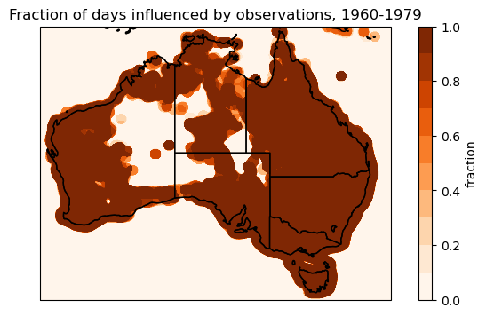

# AGCD masking

This directory contains command line programs for masking AGCD data.

If you're a member of the `wp00` project on NCI
(i.e. if you're part of the CSIRO Climate Innovation Hub),
the easiest way to use the scripts is to use the cloned copy at `/g/data/wp00/shared_code/agcd-masking/`.
They can be run using the Python environment at `/g/data/wp00/users/dbi599/miniconda3/envs/cih/bin/python`.


## Precipitation weights

In parts of regional Australia there are large distances between rain gauges
for which daily values are available.
This means there are grid point values in the AGCD daily gridded precipitation data
that haven't been influenced by actual precipitation observations.
These grid points are filled (I think) with a climatological mean value
derived from the monthly precipitation dataset (which has better observational coverage).
For many analyses (e.g. trends, return periods) it can be a good idea to mask these grid points
because they have artificially low variability.

To help with this masking,
the AGCD dataset includes precipitation weight files assign the following values
at each grid point and time step:  
- 0: Observations have no influence on analysed value  
- 1: Observations have minimal influence  
- 3: Observations influence the analysed value  

The `agcd_weight_fraction.py` script can be used to calculate the fraction of days at each grid point
that had good observational (i.e. rain guage) coverage.

```
$ /g/data/wp00/users/dbi599/miniconda3/envs/cih/bin/python /g/data/wp00/shared_code/agcd-masking/agcd_weight_fraction.py -h
usage: agcd_weight_fraction.py [-h] [infiles ...] outfile

Command line program for calculating AGCD observation coverage.

AGCD precipitation weight files assign the following values
at each grid point and time step:
  0: Observations have no influence on analysed value
  1: Observations have minimal influence
  3: Observations influence the analysed value

This script calculates the fraction of days where observations influence the data.
In other words, it counts the fraction of days where the weight value is 3.
These fractions can be used to mask grid points that had little/no influence from
observations over a period of interest. 

positional arguments:
  infiles     input AGCD weights files
  outfile     output file name

options:
  -h, --help  show this help message and exit
```

For example, 

```
$ /g/data/wp00/users/dbi599/miniconda3/envs/cih/bin/python /g/data/wp00/shared_code/agcd-masking/agcd_weight_fraction.py /g/data/zv2/agcd/v1/precip/weight/r005/01day/agcd_v1_precip_weight_r005_daily_19[6,7]*.nc /g/data/wp00/users/dbi599/agcd_v1_precip_weight_r005_obs-fraction_1960-1979.nc
```

The resulting file is plotted in `obs_weight_fraction.ipynb`.




## Applying a mask

The `apply_mask.py` script then takes a weight fraction file and masks any grid points below a specified fraction.
It is also possible to pass the script a shapefile from [this repository](https://github.com/DamienIrving/shapefiles)
to mask all ocean points.

```
$ /g/data/wp00/users/dbi599/miniconda3/envs/cih/bin/python /g/data/wp00/shared_code/agcd-masking/apply_mask.py -h
```

```
usage: apply_mask.py [-h] [--obs_fraction_file OBS_FRACTION_FILE] [--fraction_threshold FRACTION_THRESHOLD]
                     [--land_boundary LAND_BOUNDARY]
                     infile [variables ...] outfile

Command line program for applying a mask/s to AGCD data.

positional arguments:
  infile                input AGCD file name
  variables             variables
  outfile               output file name

options:
  -h, --help            show this help message and exit
  --obs_fraction_file OBS_FRACTION_FILE
                        File containing fraction of days influenced by obs (see agcd_weight_fraction.py)
  --fraction_threshold FRACTION_THRESHOLD
                        Obs fraction below which points are masked [default = 0.9]
  --land_boundary LAND_BOUNDARY
                        Shapefile for masking ocean points
```

For example,

```
$ /g/data/wp00/users/dbi599/miniconda3/envs/cih/bin/python /g/data/wp00/shared_code/agcd-masking/apply_mask.py /g/data/wp00/users/dbi599/precip_ari_AGCD_1960-1979.nc precip /g/data/wp00/users/dbi599/precip_ari_AGCD_1960-1979_masked.nc --obs_fraction_file /g/data/wp00/users/dbi599/agcd_v1_precip_weight_r005_obs-fraction_1960-1979.nc --land_boundary /g/data/wp00/shared_code/shapefiles/australia/australia.shp
```
